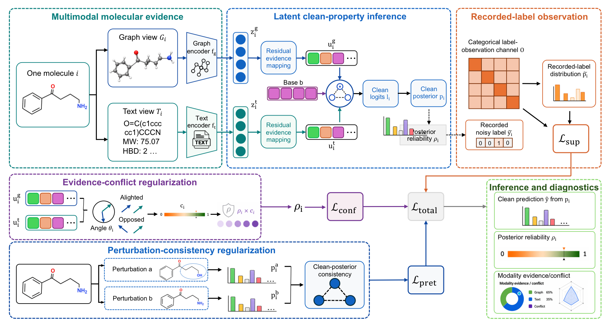

# MOLAR

Code for **MOLAR: Learning Multimodal Molecular Representations from Noisy Labels**.

MOLAR learns molecular representations from noisy bioactivity labels by combining graph and text evidence, inferring latent clean molecular properties, and explicitly modeling the recorded noisy-label observation channel.

## Overview



## Repository Structure

```text
assets/           model overview figure
configs/          default MOLAR configuration
control-noise/    raw MoleculeNet datasets for controlled label flipping
data/             molecular graph/text data loading utilities
models/           MOLAR model and loss function
noise-7/          natural-noise MF-PCBA benchmark datasets
scripts/          training, preprocessing, and evaluation scripts
```

## Environment

Create the conda environment used for the experiments:

```bash
conda env create -f environment.yml
conda activate bio
```

The code supports CUDA when available. CPU execution is possible but substantially slower.

## Train All Tasks

### Natural-Noise MF-PCBA Tasks

The seven natural-noise datasets are included in `noise-7/`. Each task contains the SD training split and DR validation/test splits used by MOLAR.

Run all seven tasks:

```bash
python scripts/run_molar_gpu_parallel.py \
  --config configs/config_molar.yaml \
  --data_root noise-7 \
  --gpus 0,1 \
  --out_dir runs/molar_natural
```

For a single GPU, use `--gpus 0`. The script writes logs and metrics to the selected `runs/` directory.

### Controlled-Noise MoleculeNet Tasks

The controlled-noise experiments use four MoleculeNet datasets: HIV, BACE, BBBP, and ClinTox. Raw files are included in `control-noise/raw/`.

First prepare graph and text features:

```bash
python scripts/prepare_control_datasets.py \
  --root control-noise \
  --datasets hiv,bace,bbbp,clintox \
  --device cuda
```

Then create the fixed 5-fold 3:1:1 label-flip protocols:

```bash
python scripts/prepare_flip_labels.py \
  --data-root control-noise \
  --datasets hiv,bace,bbbp,clintox \
  --noise-ratio 0.30 \
  --num-folds 5 \
  --seed 42
```

For a lightweight preprocessing check without transformer text embeddings, add `--skip-embeddings` to `prepare_control_datasets.py`.
